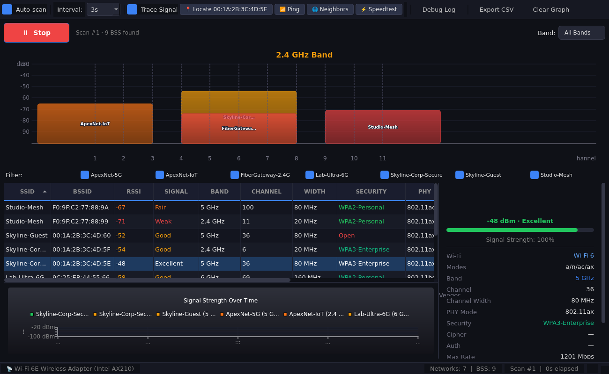

# WLAN Scan

Professional Wi-Fi network analysis and diagnostics tool. Built with Python and PySide6.



## Features

### Core Analysis
- **Visual Channel Map** — Networks positioned on their actual channel frequencies with width proportional to channel bandwidth (20/40/80/160 MHz) and height showing signal strength. Semi-transparent fills reveal overlapping networks. SSID labels rendered inside bars with outlined text for readability.
- **Real-Time Signal Graphs** — Track RSSI over time for any network. Auto-tracks the top 6 networks by signal strength. Select individual BSSIDs for isolated tracking.
- **Comprehensive Scanning** — SSID, BSSID, RSSI (dBm), channel, band, PHY mode, security details, channel utilization from 802.11 Information Elements.
- **Configurable Scan Interval** — Adjustable from 0.25s to 30s. Sub-second scanning for real-time observation of roaming and channel changes.
- **Adapter Capability Detection** — Reports supported bands (2.4/5/6 GHz) and Wi-Fi generations (n/ac/ax/be). Flags missing 6 GHz or 5 GHz capability with colored status indicators.

### Network Diagnostics
- **Ping Test** — Pop-out window with continuous ping, real-time stats (sent/received/lost/min/avg/max), color-coded output, auto-scroll toggle, and gateway auto-detection. Multilingual output parsing (English, German, French, Spanish).
- **Neighbor Report** — ARP scan and subnet ping sweep to discover all devices on the local network. Correlates entries with known BSSIDs to label APs vs clients. Client isolation detection with a single glance. Vendor OUI lookup for every MAC address.
- **Speedtest** — Ookla CLI integration with large result cards (ping, jitter, download, upload), server and ISP info, color-coded quality thresholds, and one-click result sharing via speedtest.net.

### Security
- **WEP/WPA/WPA2/WPA3 Detection** — Parses RSN and WPA IEs for cipher suites (CCMP, TKIP, GCMP), AKM suites (PSK, 802.1X, SAE, OWE), and PMF capability.
- **Client Isolation Check** — The neighbor report shows whether AP isolation is active by comparing visible client devices to expected network activity.

### Quality of Life
- **Dark Theme** — Designed for extended use without eye strain. Consistent dark palette throughout all dialogs and widgets.
- **BSSID Tracking** — Track a specific BSSID across scans to watch for signal changes. Visual RSSI bar in the status bar.
- **Network Filtering** — Toggle individual SSIDs on/off in the channel map and signal graph.
- **Band Selection** — Filter views to 2.4 GHz, 5 GHz, or 6 GHz bands individually.
- **CSV Export** — Export current scan results for analysis in spreadsheets or other tools.
- **Vendor Lookup** — MAC OUI vendor identification with auto-downloading IEEE database.
- **Wi-Fi 6/6E/7 Support** — HE (802.11ax) and EHT (802.11be) PHY type detection.

## Requirements

- Windows 10 or 11 (x64 or ARM64), or macOS 12+ (Intel or Apple Silicon)
- Python 3.10+
- A Wi-Fi adapter (built-in or USB)
- Ookla Speedtest CLI (optional, for speedtest feature — download from [speedtest.net/apps/cli](https://www.speedtest.net/apps/cli))

## Quick Start

```bash
# Clone
git clone https://github.com/bryjogar/wlan-scan.git
cd wlan-scan

# Create virtual environment (recommended)
python -m venv .venv
.venv\Scripts\activate        # Windows
source .venv/bin/activate     # macOS/Linux

# Install dependencies
pip install -r requirements.txt

# Run
python main.py
```

## Build & Release

- **Windows (folder):** `python build_exe.py` → `dist/WLAN Scan/` (portable folder, no install)
- **Windows (single file):** `python build_portable.py` → `dist/WLAN-Scan-Portable.exe` — one self-contained exe, no `_internal` folder. Slower to start (extracts to temp each run) but pushable to a client device by remote tooling that only moves one file.
- **macOS:** `python build_mac.py` → `dist/WLAN Scan.app` + zip (must run on a Mac)

### Release via GitHub Actions (recommended)

Tag a release and CI builds both platforms and publishes a GitHub Release:

```
git tag wlan-scan-v1.0.0
git push origin wlan-scan-v1.0.0
```

The workflow (`.github/workflows/wlan-scan.yml`) runs the test suite, builds
Windows + macOS, zips both, and creates a release with the downloads attached.
The in-app **Update available** link points at the latest release.

### CLI Mode

```bash
# Quick scan
python main.py --cli

# Scan and export CSV
python main.py --export
```

## How It Works

### Windows Scanner (`scanner.py`)
Uses Windows' native `wlanapi.dll` via ctypes to:

1. **Open a WLAN handle** via `WlanOpenHandle()` with client version 2.0
2. **Trigger active scans** via `WlanScan()` — requests the adapter to probe all channels
3. **Retrieve BSS lists** via `WlanGetNetworkBssList()` — returns each BSS entry with RSSI in dBm, center frequency in kHz, PHY type, and raw 802.11 Information Elements
4. **Parse IEs** to extract channel utilization (BSS Load IE), security details (RSN/WPA IE), channel width (HT/VHT/HE Operation IE), station count, and more
5. **Look up vendors** from the IEEE OUI database (auto-downloaded and cached locally)
6. **Detect adapter capabilities** via `WlanGetInterfaceCapability()` — reports supported PHY types, maps them to bands and Wi-Fi generations

### ARM64 Fallback (`pwsh_scanner.py`)
Windows on ARM has a known ctypes/libffi issue with wlanapi.dll. A PowerShell-based scanner bridges this gap using the same underlying Windows APIs via .NET P/Invoke. The GUI auto-detects the platform and uses the appropriate scanner.

### Diagnostic Tools
- **Ping** — Uses `ping -t` on Windows with background threading and regex parsing for multilingual output
- **Neighbor Scan** — Uses `arp -a` for cached ARP entries plus a threaded ICMP ping sweep to populate the cache across the subnet
- **Speedtest** — Shells out to the Ookla Speedtest CLI (`speedtest --format=json --progress=yes`), parses JSON for bandwidth (bytes/sec → Mbps) and latency

## Architecture

```
wlan-scan/
├── main.py                    # Entry point (GUI or CLI)
├── build_exe.py               # PyInstaller packaging script (Windows folder)
├── build_portable.py          # PyInstaller packaging script (Windows onefile)
├── build_mac.py               # PyInstaller packaging script (macOS bundle)
├── requirements.txt
├── wlan_scan/
│   ├── scanner.py             # wlanapi.dll ctypes wrapper (Windows)
│   ├── pwsh_scanner.py        # PowerShell/.NET fallback for Windows ARM64
│   ├── netsh_scanner.py       # netsh-based fallback (legacy)
│   ├── macos_scanner.py       # macOS scanner dispatcher
│   ├── airport_scanner.py     # macOS airport CLI scanner
│   ├── corewlan_scanner.py    # macOS CoreWLAN framework scanner
│   ├── connection.py          # Active Wi-Fi connection info
│   ├── ie_parser.py           # 802.11 Information Element parser
│   ├── vendor_lookup.py       # MAC OUI vendor identification
│   ├── oui_lookup.py          # OUI database downloader
│   ├── models.py              # Data models (Network, BSSEntry, ScanResult, InterfaceCapability)
│   ├── logging_setup.py       # Structured logging
│   ├── updater.py             # Auto-update check
│   ├── version.py             # Version constant
│   ├── resources/             # Static resources
│   └── gui/
│       ├── main_window.py     # Main application window, toolbar, timer loop
│       ├── channel_map.py     # Visual channel map widget (custom QPainter)
│       ├── signal_graph.py    # Real-time signal graph (PySide6 QtCharts)
│       ├── network_table.py   # Sortable/filterable network table
│       ├── detail_panel.py    # Network detail panel with IE breakdown
│       ├── bssid_tracker.py   # BSSID tracking worker with signal polling
│       ├── ping_dialog.py     # Pop-out ping test with live stats
│       ├── neighbor_dialog.py # ARP scanner and client isolation check
│       ├── speedtest_dialog.py# Ookla speedtest with result cards
│       └── styles.py          # Dark theme constants, signal colors
└── tests/                     # Test suite
    ├── test_airport_scanner.py
    ├── test_connection.py
    └── test_corewlan_mapping.py
```

### Data Flow
```
WlanScan() → WlanGetNetworkBssList()
    → parse BSS entries (frequency → channel/band, RSSI, PHY type)
    → parse raw IEs (RSN, HT/VHT/HE caps, BSS Load)
    → lookup vendors (MAC OUI → manufacturer)
    → emit ScanResult to GUI
        → Network Table (sortable rows)
        → Channel Map (frequency-positioned bars)
        → Signal Graph (time-series RSSI)
        → Detail Panel (IE drill-down)
```

## Roadmap

### Completed
- [x] **macOS support** — Native scanner via CoreWLAN and `airport` CLI, platform-appropriate subnet detection, unified cross-platform backend interface

### Next
- [ ] **Windows installer** — `.msi` or `.exe` package via PyInstaller / Inno Setup
- [ ] **Spectrum analysis integration** — Wi-Spy, MetaGeek, or other SDR hardware
- [ ] **Signal heatmap overlay** — Floorplan import with signal interpolation

### Later
- [ ] PCAP file import/export for offline analysis
- [ ] Remote sensor support (Raspberry Pi / secondary adapters)
- [ ] Channel utilization trending over time
- [ ] Alerting (new network detection, signal drops below threshold, rogue AP detection)
- [ ] Linux support (nl80211 / iw)

## License

MIT
